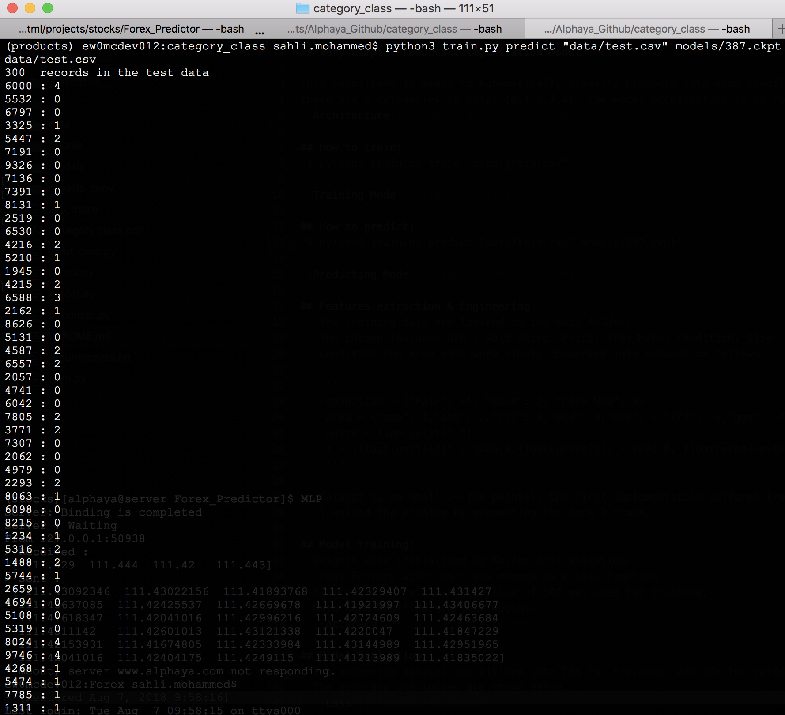

## Very Simple Products Categorization Model

This repository is meant to automatically classify products into some specific categories.
there are 5 categories in total {0,1,2,3,4}. The model architecture is as follows:

## How to train:
'$ python3 train.py train "data/train.csv"'

## How to predict:
'$ python3 train.py predict "data/test.csv" models/387.ckpt'

## Features extraction & Engineering
   the training data are located in the data folder.
   The chosen features are : Sold Price, Price, Area Name, Condition, Size
   Condition and Area name were simply converted into numbers as follows:

    '''
    condition = {"Fair": -1, "Good": 2, "Like New": 3}
    area = {"aaa": 1,"bbb": 2,"ccc": 3,"ddd": 4,"eee": 5,"fff": -6,"ggg": -7,"hhh": -8,"jjj": -9,"kkk": -10}
    units = line.split(",")
    X = [float(units[2]) / 1000.0,float(units[3]) / 1000.0, float(area[units[4]]), float(condition[units[5]]), -float(units[6])]
    '''

   Dataset is so small (~ 700 points), the first implementation suffered from overfitting,
   I solved the problem by augmenting the data 3 times.

## Model training:
  Weights were initialized by Xavier Initialization
  Cross Entropy with logit was chosen as a loss function
  Adam optimizer with a batch size of 500 was used for training.
  Data were shuffled every 10 epochs.
  

## Model Evaluation:
  The augmented dataset was divided into 70% for training, and 30% for validation.
  The accuracy and losses are shown below.
  
